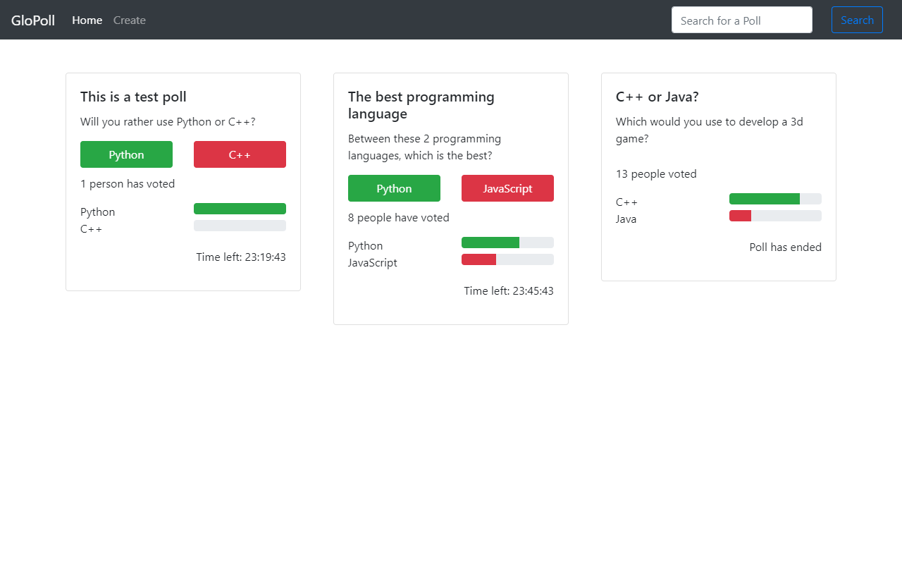

# glopoll-django

A Django+ReactJs implementation of my poll app

# development
When using the application in a development server, I recommend running your React dev server and Django server differently,
to speed things up and prevent you from having to build each time you make changes

# deploy
After everything is done, run `npm run build` to build a production version of the app
The template directory is already specified in the settings file 

# images

# todo
implement sessions to prevent multiple voting
